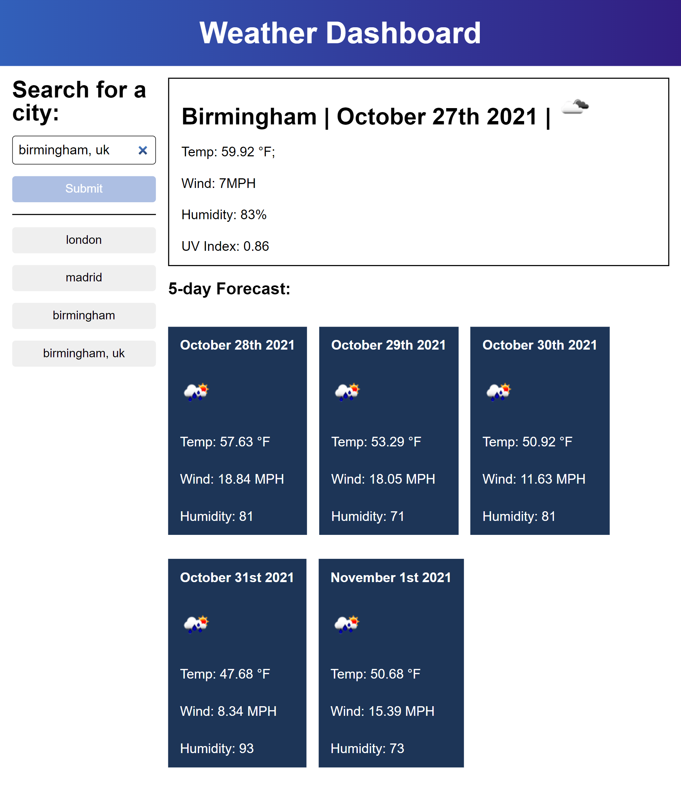

## **Table of Contents**

1.  [Deployed Link](#deployed-page-url)
2.  [Description](#introduction)
3.  [Technologies Used](#technologies-used)
4.  [User Flow](#user-flow)
5.  [Application Demo](#application-demo)

## **Deployed Link**

https://darionrichards.github.io/weather-dashboard/

## **Description**

In this project, I have created a dynamic web application where users can search a specific location, which will force web application to fetch data from the OpenWeatherMap API. When the user receives information regarding the location searched, that search will be pushed into local storage, where upon reloading the web page, the user's recent search history will be stored and displayed, the user then may click the recent search which will render the information regarding the current & forecast weather, of a given location.

## **Technologies Used**

- HTML
- CSS
- Media Query
- JavaScript
- jQuery
- Open Weather Map API
- Moment.js
- Local Storage

## **User Flow**

- WHEN a user loads the page.
- THEN nothing is displayed.
- WHEN a user makes a search for a city.
- THEN that city is displayed regarding the current and forecast weather AND is stored within local storage.
- WHEN a user reloads the page.
- THEN the users recent search history is retrieved from local storage AND displayed on the page.
- WHEN a user clicks a city within their recent search history.
- THEN that city is dynamically rendered.

## **Application Demo**

